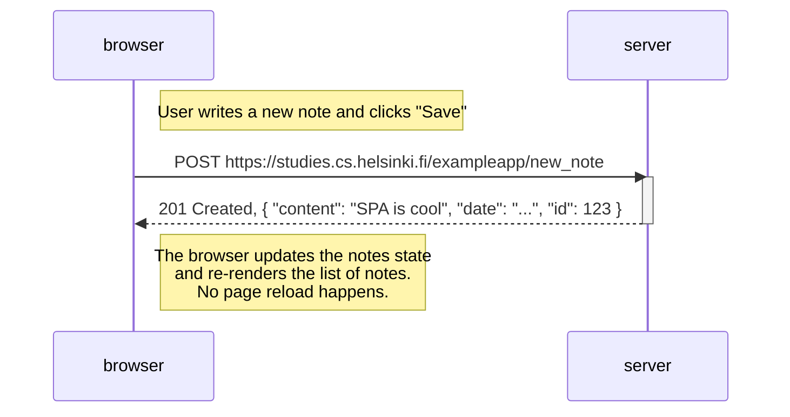

```mermaid
sequenceDiagram
    participant browser
    participant server

    Note right of browser: User writes a new note and clicks "Save"

    browser->>server: POST https://studies.cs.helsinki.fi/exampleapp/new_note
    activate server
    server-->>browser: 201 Created, { "content": "SPA is cool", "date": "...", "id": 123 }
    deactivate server

    Note right of browser: The browser updates the notes state<br/>and re-renders the list of notes.<br/>No page reload happens.
```